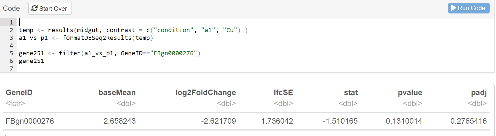

# Differential Gene Expression

## Lab Slides {#lab-slides-differential-gene-expression}

```{r, echo=FALSE, fig.alt=''}
ottrpal::include_slide("https://docs.google.com/presentation/d/1qVh8Rb52aB_Xq5WpKSOqLyB-GrLum-Y910gaITw5OVw/edit#slide=id.g35f391192_00")
```

[[slides](https://docs.google.com/presentation/d/1qVh8Rb52aB_Xq5WpKSOqLyB-GrLum-Y910gaITw5OVw)]

## Lab Activity: Differential Gene Expression

### Purpose

The purpose of this tutorial is to start asking questions about differential gene expression that you can turn into your project.

### Learning Objectives

1. Use R to analyze Gene Sets
1. Describe Differential Expression Analysis
1. Create and analyze histograms from HTSeq files
1. Calculate Differential Gene Expression in real scientific data

### Introduction

In today’s lab we will learn a hand-full of methods for looking at gene expression across the Drosophila midgut. As you work through the lab, think about scientific questions you could ask with the data, and what methods and samples would be useful for answering those questions.

### Activity 1  - Differential Expression Tutorial

*Estimated time: 45 min*

#### Instructions

1. Log into SciServer, click on compute and open your C-MOOR LearnR” container.
1. Start the “Differential Gene Expression” tutorial. Visit [SciServer Guides and FAQs](https://help.c-moor.org/t/sciserver-guides-and-faqs/22). if you need to jog your memory on how to do this.
1. To move through the activities click "Continue" at the bottom of the screen. When you are done with a topic, click "Next Topic" to move on.
1. This tutorial has small boxes in which you can enter and run short lines of code to analyze the data.
1. **Use the Notes section below to copy and paste important blocks of code that you can refer back to later.**
1. As you work through the tutorial, answer the questions below.

#### Questions

| What is the difference between the "baseMean" and the "Log2FoldChange"? |
|:-|
| <br> |

<br>

| Below are some results comparing the gene expression of one gene between two regions. Is this gene expressed to higher levels in the first sample or the second sample? Is the difference significant? |
|:-|
|  |
| <br> |

<br>

| Notes |
|:-|
| <br> |

### Activity 2 - Try it Out!

*Estimated time: 45 min*

#### Instructions

Work with a partner to complete the following analysis using the Try it Out section of the tutorial.

#### Questions

| Create a clusterProfiler graph comparing "p1" and "p2_4”. |
|:-|
| INSERT YOUR GRAPH  |

<br>

| Practice looking up a gene. Compare "p1" and "p2_4" and look up the gene FBgn0033873. What is the log2FoldChange for this gene? |
|:-|
| <br> |

<br>

| Graph FBgn0033873 across all the regions of the gut |
|:-|
| INSERT YOUR GRAPH |

<br>

| Graph the gene your group worked on in the Biological Databases Lab across all the regions of the gut. |
|:-|
| INSERT YOUR GRAPH  |

### Activity 3 - Brainstorm with Your Group

*Estimated time: 30 min*

#### Instructions

1. Use this time to discuss possible research questions for your group project. Some idea might include:
    a. An analysis of a pathway or set of genes across the gut.
    a. A detailed look at one of the three larger regions and the differences between the small segments within it.
1. How would you get started? Run some preliminary analysis and use the space below to take notes or save code that might be useful for you as you continue with your project.
1. Post your initial idea for a project on the class padlet, along with the names of everyone in your group.

#### Questions

| Notes |
|:-|
| <br> |

### Footnotes

#### Resources

- [Google Doc](https://docs.google.com/document/d/1szcQ9jDT-NzzOT_Xm80y4ulxkwkqC1ZX)

#### Contributions and Affiliations

- Stephanie R. Coffman, Ph.D., Clovis Community College

Last Revised:March 22, 2022
