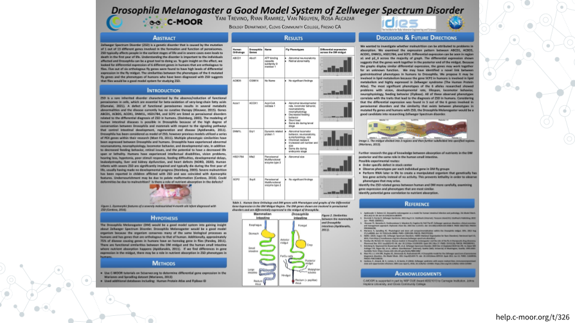

# Example miniCURE Projects

Read more about what these students did and how you can help

<h2>Zellweger Spectrum Disorder</h2>

[Drosophila Melanogaster a Good Model System of Zellweger Spectrum Disorder BIO11A SP2022](https://help.c-moor.org/t/326)

<h2>Look at This!</h2>

Explore other miniCURE and CURE projects in our [Look at This!](https://help.c-moor.org/c/look-at-this/8) category
