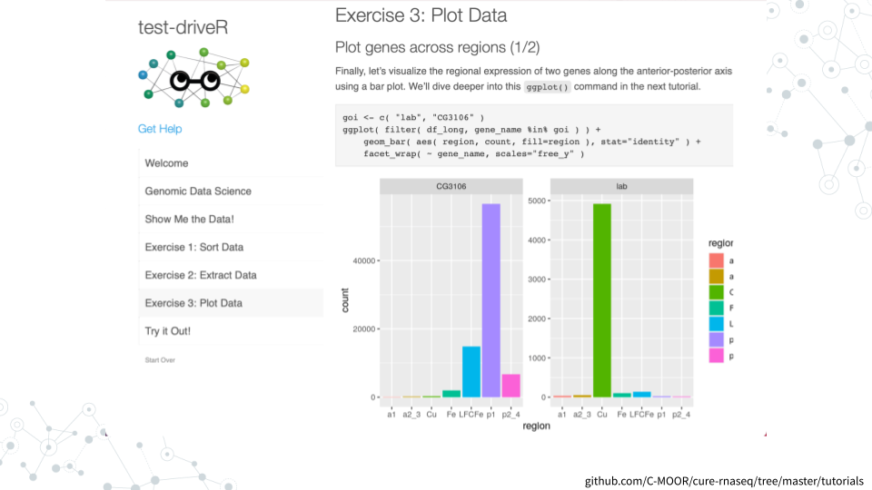

# About this Course {-}

This miniCURE allows students to develop a project using RNA-seq datasets to introduce how model organisms, high-throughput sequencing, and the scientific process are used in both basic and clinical research.

### Skills Level {- .unlisted}

::: {.notice}
_Genetics_  
**Novice**: Introduction to [central dogma of molecular biology](https://openstax.org/books/biology-2e/pages/15-1-the-genetic-code)

_Programming skills_  
**Novice**: No programming experience needed
:::

### Format {- .unlisted}

- **Class Type:** Lab (computer based)
- **Lesson Length:** Multiple class periods (4-5 lab periods)
    - Scientific Literature
    - Model Organisms and Databases
    - RNA-seq Analysis
    - Differential Gene Expression
    - *Kickstart Project Work

*Kickstart Project Work is flexible - it is enormously helpful for students to to have some guided lab time to work on the project, but this can be overlapped with a wet-lab protocol with a lot of downtime, such as PCR.

### Learning Goals {-}

- **Navigate biological databases** to access the wealth of available scientific knowledge and data.
- **Analyze data (i.e. create and interpret plots)** to generate novel conclusions.
- **Cultivate an “-omics” perspective**, integrating multiple sources of information and wielding computational tools to enable a holistic approach
- **Practice the scientific process**, identifying avenues for research, designing experiments, analyzing data, and integrating results into the broader scientific discourse.

### Core Competencies {- .unlisted}

This activity addresses the following core concepts and competencies:

<table>
<tbody>
  <tr>
   <td style="text-align:left;"> **Vision and Change** </td>
   <td style="text-align:left;"> Concepts

<ul>
<li>**3**: INFORMATION FLOW, EXCHANGE, AND STORAGE</li>
</ul>
Competencies

<ul>
<li>**1**: Ability to apply the process of science</li>
<li>**2**: Ability to use quantitative reasoning</li>
<li>**5**: Ability to communicate and collaborate with other disciplines</li>
</ul> </td>
  </tr>
  <tr>
   <td style="text-align:left;"> **Genetics** </td>
   <td style="text-align:left;"> Concepts

<ul>
<li>How is genetic information expressed so it affects an organism’s structure and function?</li>
<li>How do the results of molecular genetic studies in model organisms help us understand aspects of human genetics and genetic diseases?</li>
<li>What experimental methods are commonly used to analyze gene structure, gene expression, gene function, and genetic variants?</li>
</ul>
Competencies

<ul>
<li>Locate, read, and comprehend primary literature research papers on genetics topics</li>
<li>Implement observational strategies to formulate a question</li>
<li>Generate testable hypotheses</li>
<li>Generate and interpret graphs displaying experimental results</li>
<li>Critique large data sets and use bioinformatics to assess genetics data</li>
<li>Communicate experimental results effectively, including writing research papers and giving presentations</li>
</ul> </td>
  </tr>
  <tr>
   <td style="text-align:left;"> **Bioinformatics** </td>
   <td style="text-align:left;"> <ul>
<li>**C1**: Explain the role of computation and data mining in addressing hypothesis-driven and hypothesis-generating questions within the life sciences</li>
<li>**C4**: Use bioinformatics tools to examine complex biological problems in evolution, information flow, and other important areas of biology</li>
<li>**C5**: Find, retrieve, and organize various types of biological data</li>
<li>**C6**: Explore and/or model biological interactions, networks and data integration using bioinformatics</li>
</ul> </td>
  </tr>
</tbody>
</table>

Core concepts and competencies are taken from the following sources:

  - [Vision and Change in Undergraduate Biology Education](https://visionandchange.org/) AAAS report
  - [Genetics Learning Framework](https://genetics-gsa.org/education/genetics-learning-framework/) by [GSA](https://genetics-gsa.org/)
  - [Bioinformatics core competencies for undergraduate life sciences education](https://doi.org/10.1371/journal.pone.0196878) by [NIBLSE](https://qubeshub.org/community/groups/niblse)

### C-MOOR Collection {- .unlisted}

This content is part of a collection of teaching resources developed by C-MOOR.  C-MOOR works to break down barriers to scientific participation and build pathways for the next generation of data scientists through authentic research experiences.  Learn more about C-MOOR by [viewing our projects](https://github.com/c-moor), or read about how C-MOOR is [integrating research experience into undergraduate biology courses](https://www.cloviscollege.edu/alumni-and-community/c-moor/c-moor.html) at Clovis Community College.
