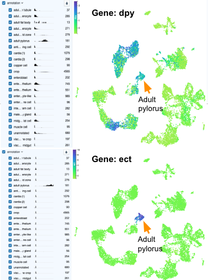

# Single-cell RNA-seq Analysis

## Background: Single-cell RNA sequencing

### Purpose

The purpose of this lab is to introduce single-cell RNA sequencing, how it works, and how it is different from bulk RNA sequencing.

### Learning Objectives

1. Compare and contrast single-cell and bulk RNA-seq
1. Explain what a UMAP plot is and why it is useful for single-cell RNA-seq

### Introduction

While bulk RNA sequencing allows us to examine gene expression in a tissue as a whole, newer technologies enable us to look at gene expression in individual cells, opening up new avenues for scientific research. This tutorial will explain the basics of single-cell RNA sequencing and discuss how it compares to bulk RNA-seq. It will also introduce you to UMAP plots - a common method for exploring single-cell sequencing data.

### Activity 1 - Biotechnology: scRNA-seq

*Estimated time: 15  min*

#### Instructions

1. Watch this video ([video](https://drive.google.com/file/d/1E9WqaYNs_hc4W8phFtkmcfTBQd8SatA5/))([slides](https://docs.google.com/presentation/d/1axiRC66t6HYkCPzmxNdHXWqR5OpwPfiZxOkocrxji54/)) introducing single-cell RNA-seq.

#### Questions

**Which of the following steps are typically involved in bulk vs. single-cell RNA-sequencing?**

- **A) Obtain/dissect sample**
- **B) Separate cells**
- **C) Select for mRNA**
- **D) Convert to cDNA**

**List the steps involved in each technique.**

| | |
|:-|:-|
| Bulk RNA-seq | |
| Single-cell RNA-seq | |

 

**Which of the following scientific questions can be investigated using bulk vs. single-cell RNA-sequencing?**

- **Compare gene expression between healthy and diseased samples**
- **Investigate gene expression changes as an embryo develops**
- **Compare gene expression between different cells within a tissue**

**For each scientific question, state whether it can be investigated with bulk, single-cell, or both, and briefly explain your answer.**

| | |
|:-|:-|
| Healthy vs. diseased | |
| Embryo development | |
| Compare cells | |

### Activity 2 - Introduction to UMAP plots

*Estimated time: 10  min*

#### Instructions

1. Watch this video ([video](https://drive.google.com/file/d/1okkFjNhcvY_Xp_wdDalhb422dW1tz2Yj))([slides](https://docs.google.com/presentation/u/0/d/1QequxyKSeXFAeon2NIkOwi51pXqZgKnXg6trAipNDKk/)), which explains what a UMAP plot is and why it’s useful for single-cell RNA-seq.

#### Questions

| Explain why UMAP plots are useful for looking at single-cell RNA-seq data |
|:-|
|   |

### Footnotes

#### Resources

- [Google Doc](https://docs.google.com/document/d/1LY30hkP8hY2_I5h45pJLgOXGInxfK6v7M7I3JDV6_pA/)

#### Contributions and Affiliations

- Katherine Cox, Ph.D., Johns Hopkins University
- Javier Carpinteyro-Ponce Ph.D., Carnegie Institution for Science
- Matthew McCoy, Ph.D., Stanford University
- Frederick Tan, Ph.D., Carnegie Institution for Science

Last Revised: October 2023

## Lab Activity: Single-Cell RNA-seq

### Purpose

This lab will teach students how to explore single-cell RNA-seq data.  This will enable them to use scRNA-seq data to investigate their scientific questions.

### Learning Objectives

1. Launch cellxgene on SciServer.
1. Use cellxgene to determine which cell types express a gene.
1. Compare expression of different genes across cell types.

### Introduction

In this lab, students will explore single-cell RNA-seq data from the *Drosophila* gut, using data from the Fly Cell Atlas.  The Fly Cell Atlas is a large collection of single-cell sequencing data from *Drosophila* (fruit flies), with the goal of creating a map of all the cell types in a fruit fly.  Many scientists have contributed to the Fly Cell Atlas, and it is an incredible resource for anybody working with fruit flies.  

Analyzing single-cell sequencing data is difficult, because there is just so much data!  The **cellxgene** (pronounced “cell-by-gene”) tool provides an interactive visualization of the data, giving investigators a big-picture overview of the data and also enabling them to select specific cell types or genes for further investigation.  The Fly Cell Atlas has made cellxgene available on its website ([flycellatlas.org](https://flycellatlas.org/)), but for this lab we will use cellxgene on SciServer as it offers more functionality (e.g. ability to identify differentially expressed genes).  Learning how to use cellxgene will give students a valuable tool for investigating scientific questions.

Watch this video ([video](https://drive.google.com/file/d/1lBrN1ul5PEg6MDoYkGZ_MOCHHzYZydDF/))([slides](https://docs.google.com/presentation/d/1VpdaBbZ04qUa2A_W9UwWEF_FVKfhImIt0703z4X1Vqo/edit#slide=id.g28a33aed8b2_0_253)) to learn more about Fly Cell Atlas and cellxgene.

### Activity 1 - Launch cellxgene on SciServer

*Estimated time: 15 min*

#### Instructions

1. Log into SciServer.
1. Follow the instructions in this video ([video](https://drive.google.com/file/d/11ZUswWj3MCaikhWIbEjK8LZ6i-Lum04I))([slides](https://docs.google.com/presentation/u/0/d/1NIUcSVoMlcVNphcLfS15jouG3_AYYYTrKwgcTrHr0zU/edit)) to launch cellxgene on SciServer with the *Drosophila* gut data.
1. Look at the data on SciServer and answer the question below.

#### Questions

| How many cell types are annotated in the *Drosophila* gut dataset? |
|:-|
|   |

### Activity 2 - Explore genes of interest identified by differential expression analyses

*Estimated time: 15 min*

#### Instructions

1. Launch cellxgene on SciServer.
1. Follow the instructions in this video ([video](https://drive.google.com/file/d/11PFYc2K4qYYvFYc05TCIyarliuWOmQ5x/view?usp=drive_link)) ([slides](https://docs.google.com/presentation/u/0/d/1b9OqXaqUGo0gAnsfbKD6PuLSqbpdREh241UkN_WwQIc/edit)) to learn how to explore the expression of genes of interest 
1. Set cellxgene to show the expression of the gene Cht8, and answer the question below.  (You can refer back to the video for how to view expression of a specific gene.)

#### Questions

**In which of the following cell types is the gene Cht8 expressed the most?**

- **A) Crop**
- **B) Cardia**
- **C) Posterior midgut**
- **D) Anterior midgut**

| |
|:-|
|   |

### Activity 3 - Differential expression and gene marker identification

*Estimated time: 15 min*

#### Instructions

1. Launch cellxgene on SciServer.
1. Follow the instructions in this video ([video](https://drive.google.com/file/d/1xAM2llmKqMjUhOs_XEVv9NgunZ7Gp8DF/view?usp=drive_link)) ([slides](https://docs.google.com/presentation/u/0/d/1kVLH-n04mZh4KzUaGj0E2pUpiwu51IACGzvkznLT1FM/edit)) to learn how to perform differential gene expression and explore genes of interest using cellxgene.

#### Questions

{width=80%}

"Gene markers" are genes that are expressed in one cell type and not in any others.  We call them "markers" because we can use them to tell cell types apart.

| Looking at the UMAP plots above, which gene (dpy or ect) is a better gene marker for the adult pylorus cells? |
|:-|
|   |

 

| Explain your answer to the previous question. |
|:-|
|   |

### Footnotes

#### Resources

- [Google Doc](https://docs.google.com/document/d/1sKqNfe9iFLlGcuL0OHQ_aGARwC_Sqb8IQjIfwzP629Y/)

#### Contributions and Affiliations

- Javier Carpinteyro-Ponce Ph.D., Carnegie Institution for Science
- Katherine Cox, Ph.D., Johns Hopkins University
- Matthew McCoy, Ph.D., Stanford University
- Frederick Tan, Ph.D., Carnegie Institution for Science

Last Revised: October 2023

